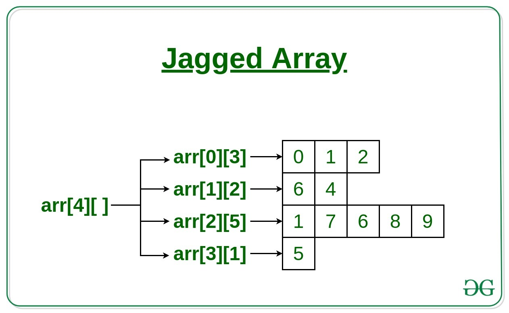

# 📝 Introduction
Welcome to my Java learning journey! This README serves as a collection of essential Java concepts, examples, and notes that will help me build strong programming skills for the future.

# 🔰 Java Installatio
- Download & Install <ins>[Java JDK](https://www.oracle.com/java/technologies/downloads/?er=221886)</ins> (Install JDK-21 or JDk-24, x64 installer)
- Set up environment variables step by step

    - Go to C drive
    - Go to program files
    - Go to java
    - Go to bin folder
    - Then Press `Ctrl+c` to copy the whole path
    - Now go to Environment variables
    - Now go to system variable 
    - And paste the whole path of `JDK`

# 🚀 Install Eclipse IDE
- Download and Install Eclipse(First time setup)
    - Install eclipse and open it
    - Select `Eclipse IdE for java developer`
    - Now Install it ( By default default JdK path and Installation path will be set )
    - Accept terms & condition
    - Hit the lanch buttion
    - Selected a directory as a workspace( Recomended create a folder in D drive then set it)
# 🎯 Create Your First Java File
- Open `eclipse`
- click on `file` and then `new`
- click on `java project`
- Give project name(Its like a folder there will be many java file under it.)
- Click `use default JRE ...Prefreence`
- uncleck module
  - [ ] Create module -info.java file
- Now click the finish button to finished it.<br><br>
#### A folder will oppend on the left hand side
- go to that folder
- Inside src folder create class 
- class name will be the same as file name(like- if you want ot give a file name `Add_to_number.java` then class name will be `Add_to_number`).Try to give class name as capital it is a good practice.
- [✅] Public static void main(click it if unchecked)
- Now finished it.
- Create your first hello_world program.


# 🎯 How to run code in Notepad
- Open notepad
- Write the code
- Sava the file( make sure save as type is `all type` & file name save same as class name)

<br><br>

- open terminal
- go to that particular directory<br><br>


- type `javac Text1.java` It will be compiled
- Now write `java Test1` It will run the code


<h1 align="center">🏆 CLASS 1</h1>

#### 🎯 Topics Covered
- Concept Covered: `System.out.println()`
- Objective: Learn how to display a message on the screen using Java.
- Example Code:
```java
//First hello world program
public class Hello_world {

	public static void main(String[] args) {
		System.out.println("Hello, welcome to java");
        
	}
}
```
- Explanation:
    - `public class HelloWorld`: Declares a class named `HelloWorld`.
    - `public static void main(String[] args)`: Defines the main method, where execution starts.
    - `System.out.println("Hello, welcome to java");`: Prints the message `"Hello, welcome to java"` to the console.
    <br><br>
<h1 align="center">🏆 CLASS 2</h1>

#### 🎯 Topics Covered
- Adding Two Numbers (Static and User Input)
```java
public class Add_to_number {
	//Add two number, the two numbers are statically allocate not dynamically we will learn farther how to take user input
	public static void main(String[] args) {
		int x=20;
		int y=10;
		int z=x+y;
		System.out.println("Result is:"+z);
	}
}
```

- Data Types & User Input Handling
```java
import java.util.Scanner;

public class Datatypes {

	public static void main(String[] args) {
		
		int a;
		float b;
		double c;
		char d;
		long e;
		short f;
		byte g;
		boolean h;
		
		Scanner sc= new Scanner(System.in);
		
		System.out.print("Enter Integer(A):");
		a=sc.nextInt();
		
		System.out.print("Enter float(B):");
		b=sc.nextFloat();
		
		System.out.print("Enter Double(C):");
		c=sc.nextDouble();
		
		System.out.print("Enter Char(D):");
		d=sc.next().charAt(0);
		
		System.out.print("Enter Long(E):");
		e=sc.nextLong();
		
		System.out.print("Enter Short(F):");
		f=sc.nextShort();
		
		System.out.print("Enter Byte(G):");
		g=sc.nextByte();
		
		System.out.print("Enter Boolean(H):");
		h=sc.nextBoolean();
		
		System.out.println("A="+a);
		System.out.println("B="+b);
		System.out.println("C="+c);
		System.out.println("D="+d);
		System.out.println("E="+e);
		System.out.println("F="+f);
		System.out.println("G="+g);
		System.out.println("H="+h);
	}
}
```

- Conditional Statements

    - `if-else`
```java
//if_else condition is same as c programing
//Elegable for vote or not check
import java.util.Scanner;
public class If_else_condition {

	public static void main(String[] args) {
		
		Scanner sc= new Scanner(System.in);
		System.out.print("Enter the age:");
		int age=sc.nextInt();
		if(age>=18)
		{
			System.out.println("You can Vote");
		}
		else
		{
			System.out.println("You can't Vote");
		}

	}

}
```
- `else-if`
```java
//Find max among 3 number
import java.util.Scanner;

public class Else_if_condition {

    public static void main(String[] args) {
        Scanner sc = new Scanner(System.in);
        
        System.out.print("Enter 3 numbers: ");
        int x = sc.nextInt();
        int y = sc.nextInt();
        int z = sc.nextInt();
        int max;

        if (x == y && y == z) {
            System.out.println("All Numbers are equal");
            return; // Exit the program if all numbers are equal
        }
        if (x > y && x > z) {
            max = x;
        } else if (y > x && y > z) {
            max = y;
        } else {
            max = z;
        }
        System.out.println("Maximum number is: " + max);
    }
}
```
- Loops in Java
    - `for`
    - `while`
    - `do-while`
```java

public class Loops {

	public static void main(String[] args) {
		
		//for loop
		
//		for(int i=1;i<=5;i++)
//		{
//			System.out.println(i);
//		}
		
		//while loop
//		int i=1;
//		while(i<=5)
//		{
//			System.out.println(i);
//			i++;
//		}
		
		//Do-while loop
		
		int i=1;
		do {
			System.out.println("Even the condition is false this is printing");
			
		}while(i<=0);//this condition is flase but the print statement is printing
	}
}
```
- switch-case
```java
import java.util.Scanner;

public class Switch_case {

	public static void main(String[] args) {
		Scanner sc= new Scanner(System.in);
		int day;
		System.out.print("Enter the day:");
		day=sc.nextInt();
		while(true)
		{
			switch(day)
			{
				case 0:System.out.println("Sunday"); 
						break;
				case 1:System.out.println("Monday");
						break;
				case 2:System.out.println("Tuesday");
						break;
				case 3:System.out.println("Wednessday");
						break;
				case 4:System.out.println("Thurshday");
						break;
				case 5:System.out.println("Friday");
						break;
				case 6:System.out.println("Satarday");
						break;
				default: System.out.println("Invalid input...");
			}
		}
	}
}
```
- ternary operator
```java
import java.util.Scanner;//import the package

public class Ternary_operator {
	public static void main(String[] args) {	
    Scanner sc= new Scanner(System.in);
		System.out.print("Enter 3 number:");
		int x=sc.nextInt();
		int y=sc.nextInt();
		int z=sc.nextInt();
		int max;
		if(x==y&&y==z)
		{
			System.out.println("All Numbers are equal");
		}
		else
		{
			max=(x>y)?((x>z)?x:z):((y>z)?y:z);
			System.out.println("Maximum is: "+max);
		}	
	}	
}
```
<br>
<h1 align="center">🏆 CLASS 3</h1>

#### 🎯 Topics Covered
- 1D Array.
- 2D Array.
- Enhance for loop
- Jagged Array.

### 1. One-Dimensional (1D) Arrays
A 1D array is a simple list of elements stored sequentially in memory.
Example:
```c
//this is possiable in c programing
int arr[3]={1,2,3}//this is not possible is java
```
```java
//this is possible in java
int[] arr1 = {10, 20, 30, 40, 50};
//or
int arr2[]={1,2,3,4,5};
```
- Access elements using an index, e.g., `arr1[2]` returns `30`.
- In java array index always start with `0` like- `arr[0]=10`,
`arr[1]=20`,
`arr[2]=30`,
`arr[3]=40`,
- there is a poroperty array.length which return the array size, Here `arr1.length` will be return 5
- how to print the array element
```java
for(int i=0;i<arr1.length;i++)//Instade of arr1.length we can write 5 also
{
	System.out.print(arr2[i]+" ");
}
//Output:10,20,30,40,50
```
### Dynamic 1D Array
```java
int a[],i;
Scanner sc=new Scanner(System.in);
System.out.print("Enter the number of element:");
int	n=sc.nextInt();
a=new int[n];//dynamic 1d array declaration
for(i=0;i<a.length;i++)
{
	a[i]=sc.nextInt();
}
```
### 2.Two-Dimensional (2D) Arrays
```java
int a[3][2];//this is not possible in java
int a[][]; // this is possible
//or
int a[][]=new int [3][2]//a[3][2];
//printing process is same as c programing

for(i=0;i<a.length;i++)
{
	for(j=0;j<a[i].length;j++)
	{
		System.out.print(a[i][j]+" ");
	}
	System.out.println();
}
```
### 3.Enhance for loop
Enhance for loop only use to print the array 
- Enhance for loop for 1d array print
```java
for(int x:a)
{
	System.out.println(x);
}
```
- Enhance for loop for 2d array print
```java
for(int x[]:a)
{
	for(int y:x)
	{
		System.out.print(y+" ");
	}
	System.out.println();
}
```
### 4. Jagged array
In jagged array row is fixed but the column as per the user input.In ecah row there will be an 1d array.

```java
Scanner sc=new Scanner(System.in);
System.out.print("Enter the row:");
int r=sc.nextInt();
int a[][]=new int [r][];
int i,j;
for(i=0;i<a.length;i++)
{
	System.out.print("Enter the number of column for row "+i+" :");
	int c=sc.nextInt();
	a[i]=new int [c];
}
System.out.println("Enter the element");
for(i=0;i<a.length;i++)
{
	for(j=0;j<a[i].length;j++)
	{
		a[i][j]=sc.nextInt();
	}
}
```
<br>
<h1 align="center">🏆 CLASS 4</h1>

#### 🎯 Topics Covered
- Character Array
- String

## Character Array
```java
char s[]={'h','e','l','l','o'};
//s[0]=h,s[1]=e,s[2]=l,s[3]=l,s[4]=o
for(int i=0;i<s.length;i++)
{
	System.out.print(s[i]);//output:->hello
}
```
Seems like it is string but this is not String in `java` this is called character array.
- ### How to user input character
```java
Scanner sc=new Scanner(System.in);
System.out.print("Enter the length of the string:");
int n=sc.nextInt();
char s[]=new char [n];
System.out.println("Enter the string:");
for(int i=0;i<s.length;i++)
{
	System.out.print("S["+i+"]=");
	s[i]=sc.next().charAt(0);//if we give input 'world' it will only take first character ie 'w'.
}

System.out.print("String is:");
for(char x:s)
{
	System.out.print(x);
}
```
## String
```java
String name="Surojit Saha";
//Now we can say this is a string
```
#### How to take user input
```java
Scanner sc=new Scanner(System.in);
				
//This is how we take a user input string
String str1;
System.out.print("Enter the string:");
str1=sc.nextLine();//if we give multi world input it will take multi world input
// like- 'hello world' input output will be 'hello world'
System.out.println("String is:"+str1);
```
```java
str1=sc.nextLine();//It will take only one word like if we give input like 'hello world' it will only take 'hello'.
```

- #### How to convert String to a Character array
```java
char s1[]=str1.toCharArray();//where 'str1' is a string and 's1' is a character.
```
- #### How to convert Character array to String .
```java
char t[]= {'h','e','l','l','o'};
String str1=new String(t);
System.out.print("String is: "+str1);//output:->hello
```
- ## How to create a string

1. String class
	- String letaral
	- using `new` keywoard

2. StringBuilder class

3. StringBuffer class.
<br>
<br>
<h1 align="center">Using string letaral</h1>

```java
String s1="hello";
String s2="wolrd";
String s3="Hi";
String s4="hello";
String s5="Hello";
String s6="Kolkaa";
```

<br>
<h1 align="center">Using new keywoard</h1>

```java
String str1=new String("hello");
String str2=new String("World");
String str3=new String("hello");
```
Here we think 2 object will be created because str1 and str3 is same value but not same object here 3 object will be created.


```java
if(s1==s4)
{
	System.out.println("Same");
}
else
{
	System.out.println("Different");
}
//Output:->same

if(s1==str1)
{
	System.out.println("Same");
}
else
{
	System.out.println("Different");
}
//Output:->Different
```
`==` we checking if the two object are same or not.It did not check the value it check object that's why even s1 and str1 has same value but being different object it showing output `different`.
```java
if(s1.equal(s4))
{
	System.out.println("Same");
}
else
{
	System.out.println("Different");
}
//Output:->same

if(s1.equal(str3))
{
	System.out.println("Same");
}
else
{
	System.out.println("Different");
}
//Output:->Same
```
`.equal()` we checking if the two value are same or not.It did not check the object ,it check value that's why even s1 and str3 has different object being same value it give output `same`

<br>
<h1 align="center">🏆 CLASS 5</h1>

#### 🎯 Topics Covered
- Function of Strings

| Method                | Description                                                            | Return Type  |
|----------------------|------------------------------------------------------------------------|-------------|
| charAt()             | Returns the character at the specified index (position)               | char        |
| codePointAt()        | Returns the Unicode of the character at the specified index           | int         |
| codePointBefore()    | Returns the Unicode of the character before the specified index       | int         |
| codePointCount()     | Returns the number of Unicode values found in a string                | int         |
| compareTo()          | Compares two strings lexicographically                                | int         |
| compareToIgnoreCase()| Compares two strings lexicographically, ignoring case differences     | int         |
| concat()            | Appends a string to the end of another string                          | String      |
| contains()          | Checks whether a string contains a sequence of characters             | boolean     |
| contentEquals()     | Checks whether a string contains the exact same sequence of characters of the specified CharSequence or StringBuffer | boolean |
| copyValueOf()       | Returns a String that represents the characters of the character array | String      |
| endsWith()          | Checks whether a string ends with the specified character(s)          | boolean     |
| equals()           | Compares two strings. Returns true if the strings are equal, false otherwise | boolean |
| equalsIgnoreCase()  | Compares two strings, ignoring case considerations                    | boolean     |
| format()           | Returns a formatted string using the specified locale, format string, and arguments | String |
| getBytes()         | Converts a string into an array of bytes                               | byte[]      |
| getChars()         | Copies characters from a string to an array of chars                   | void        |
| hashCode()         | Returns the hash code of a string                                     | int         |
| indexOf()         | Returns the position of the first found occurrence of specified characters in a string | int |
| intern()         | Returns the canonical representation for the string object              | String      |
| isEmpty()        | Checks whether a string is empty or not                                | boolean     |
| join()          | Joins one or more strings with a specified separator                    | String      |
| lastIndexOf()   | Returns the position of the last found occurrence of specified characters in a string | int |
| length()        | Returns the length of a specified string                               | int         |
| matches()       | Searches a string for a match against a regular expression, and returns the matches | boolean |
| offsetByCodePoints() | Returns the index within this String that is offset from the given index by codePointOffset code points | int |
| regionMatches() | Tests if two string regions are equal                                | boolean     |
| replace()      | Searches a string for a specified value, and returns a new string where the specified values are replaced | String |
| replaceAll()   | Replaces each substring of this string that matches the given regular expression with the given replacement | String |
| replaceFirst() | Replaces the first occurrence of a substring that matches the given regular expression with the given replacement | String |
| split()       | Splits a string into an array of substrings                           | String[]    |
| startsWith()  | Checks whether a string starts with specified characters            | boolean     |
| subSequence() | Returns a new character sequence that is a subsequence of this sequence | CharSequence |
| substring()   | Returns a new string which is the substring of a specified string  | String      |
| toCharArray() | Converts this string to a new character array                      | char[]      |
| toLowerCase() | Converts a string to lower case letters                           | String      |
| toString()    | Returns the value of a String object                              | String      |
| toUpperCase() | Converts a string to upper case letters                           | String      |
| trim()       | Removes whitespace from both ends of a string                     | String      |
| valueOf()    | Returns the string representation of the specified value         | String      |